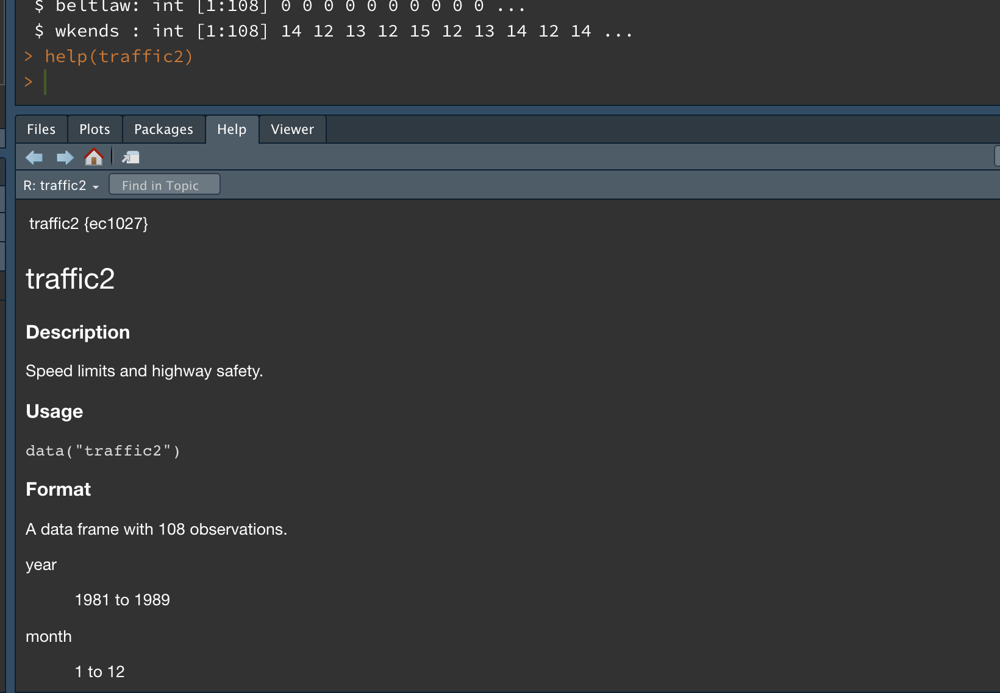
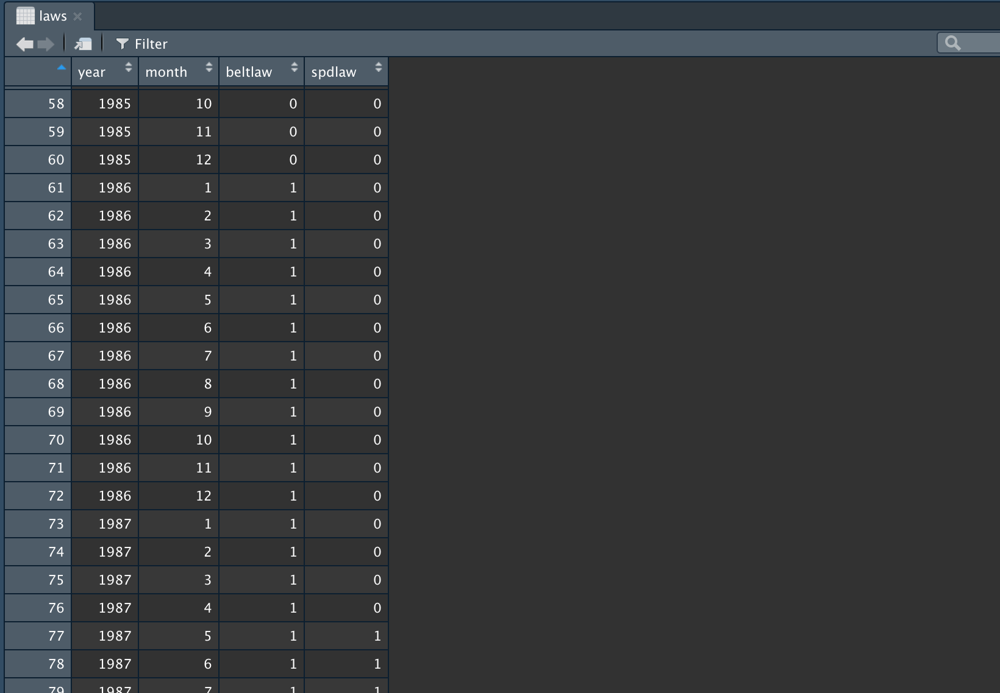

```{r child="traffic2.Rmd"}
```

## Resolución


### Datos

Necesitaremos algunos paquetes de R:

- `dynlm`: regresión con series temporales. Automáticamente carga el paquete `zoo` que proporciona funciones para trabajar con series temporales.
```{r}
library(dynlm)
```

- `ggplot2`: gráficos.
```{r}
library(ggplot2)
```

- `ec1027`: contiene la base de datos `traffic2` con la que trabajaremos en este laboratorio.
```{r}
library(ec1027)
data(traffic2)
```

Podemos ver qué variables están incluidas en la base de datos con la función `str`:
```{r}
str(traffic2)
```
Para consultar la documentación de la base de datos escribimos `? traffic2` en la consola de R o usamos la función `help`:
```{r eval=FALSE}
help(traffic2)
```


Para determinar cuándo entran en vigor las leyes de circulación, crearemos en primer lugar, una base de datos que sólo contenga las variables `year`, `month`, `beltlaw` y `spdlaw`. La función `subset` tiene el argumento `select` que nos permite especificar qué variables queremos conservar:
```{r}
laws <- subset(traffic2, select = c(year, month, beltlaw, spdlaw))
```
Ahora podemos examinar la base de datos que hemos creado haciendo doble click sobre ella en la pestaña Environment de RStudio o escribiendo `View(laws)` en la consola:



Podemos comprobar que la variable `beltlaw` toma valor 1 a partir de enero de 1986, lo que quiere decir que ése mes entró en vigor la obligación de usar el cinturón de seguridad. Por otro lado, examinando los valores de `spdlaw` concluimos que el límite de velocidad se elevó en mayo de 1987.

Finalmente, si ya no vamos a usar el conjunto de datos `laws` podemos eliminarlo de la memoria del ordenador:
```{r}
rm(laws)
```


### Tendencia y estacionalidad

Calculamos el logaritmo del total de accidentes y guardamos el resultado en `ltotacc`, una nueva variable de la base de datos `traffic2`:
```{r}
traffic2$ltotacc <- log(traffic2$totacc)
```


Con la función `zooreg` creamos a partir de `traffic2` una base de datos de series temporales: `db`. Indicamos cuál es el periodo inicial de nuestros datos en el argumento `start`. Dado que nuestra muestra comienza en enero de 1981, escribimos `start = c(1981, 1)`. Finalmente, para declarar que nuestros datos son mensuales usamos el argumento `frequency = 12`:
```{r}
db <- zooreg(traffic2, start = c(1981, 1), frequency = 12)
```

Con `autoplot` podemos obtener gráficos de las series temporales contenidas en `db`. Por ejemplo, podemos representar la evolución de `ltotacc` con:
```{r}
autoplot(db$ltotacc)
```

El gráfico anterior muestra una tendencia creciente del número de accidentes, aunque parece reducirse en los últimos años de la muestra. También se aprecian ciertos movimientos estacionales, aunque son un tanto irregulares y parecen cambiar con el paso del tiempo.

Trataremos de capturar la tendencia con una variable que toma los valores 1, 2, 3, ... En R podemos construir la variable `trend` como una secuencia de enteros desde 1 hasta el número de filas de `db` con la siguiente línea:
```{r}
db$trend <- 1:NROW(db)
```

Para estimar modelos de regresión con series temporales usaremos la función `dynlm` que añade algunas características útiles a `lm`. En este laboratorio la usaremos para introducir variables ficticias estacionales en el modelo estimado. Para ello, en la fórmula del modelo de regresión incluimos: `season(db)`. Es importante recordar que tenemos que especificar entre paréntesis la base de datos que estamos usando (en nuestro caso `db`) o una de las variables de la base de datos: podríamos haber usado `season(ltotacc)` o `season(year)`. 

Regresión de `ltotacc` con respecto de una tendencia lineal y variables ficticias estacionales:
```{r}
mod1 <- dynlm(ltotacc ~ trend + season(db), data = db)
summary(mod1)
```

El coeficiente `trend` indica que cada mes, si ignoramos las variaciones estacionales, el número de accidentes crece un `r round(100 * coef(mod1)['trend'], 2)`%. Multiplicando por 12 podemos ver que el número de accidentes crece un `r round(12 * 100 * coef(mod1)['trend'], 1)`% cada año.

Por otro lado, los parámetros de las variables ficticias comparan el número medio de accidentes que se producen cada mes con los que ocurren en enero, una vez descontada la tendencia lineal. Los resultados de la regresión indican que sólo en los meses de febrero se producen menos accidentes que en enero: un `r -round(100 * coef(mod1)['season(db)Feb'], 1)`% menos (aunque el efecto no es significativa al 5%). Hay varios meses en los que el número de accidentes es significativamente mayor que en enero: marzo, agosto, octubre, noviembre y diciembre registran entre un 5% y un 9% más accidentes que enero. Los parámetros de los restantes meses no son significativos al 5% (aunque la estimación de septiembre es significativa al 10%). Si contrastamos la significación conjunta de las variables estacionales rechazamos la hipótesis nula de que todos sus coeficientes sean iguales a 0:
```{r}
drop_test(mod1, ~ season(db))
```

### Más regresores

Estimamos un nuevo modelo de regresión donde añadimos las variables `unem`, `wkends`, `beltlaw` y `spdlaw`:
```{r}
mod2 <- update(mod1, . ~ . + unem + wkends + beltlaw + spdlaw)
summary(mod2)
```

La variable `unem` es la tasa de desempleo en California durante el periodo analizado. La estimación del efecto de esta variable es significativamente distinto de 0 al 5% y tiene signo negativo. De acuerdo con esa estimación, cuando la tasa de desempleo aumenta en un punto porcentual (por ejemplo, pasando del 5% al 6%), los accidentes de tráfico se reducen en un `r round(100 * abs(coef(mod2)['unem']), 1)`%. Posiblemente, un empeoramiento de las condiciones económicas que eleve la tasa de desempleo también tenga el efecto de reducir el volumen de tráfico en las carreteras de California y, en consecuencia, el número de accidentes disminuya.

### Variables ficticias

Los parámetros de las variables `beltlaw` y `spdlaw` miden cómo cambia el número de accidentes de tráfico como consecuencia de la entrada en vigor de la ley que obligan a usar el cinturón de seguridad y de la que eleva el límite de velocidad, respectivamente. Cada una de esas variables tienen un efecto significativamente distinto de 0 a los niveles usuales de significación. 

La estimación del parámetro de `beltlaw` indica que el número de accidentes de tráfico se elevó un `r round(100 * abs(coef(mod2)['beltlaw']), 1)`% despues de que se introdujera la obligación del uso del cinturón. Una posible explicación de este resultado es que los conductores se sientan más protegidos y que sean menos cuidadosos cuando conducen usando el cinturón.

Por otro lado, la estimación del parámetro de `spdlaw` muestra que los accidentes de tráfico disminuyeron un `r round(100 * abs(coef(mod2)['spdlaw']), 1)`% tras la elevación del límite de velocidad. Quizás los conductores de California considerasen que la ley aumentaba el riesgo de sufrir un accidente y se mostraran más precavidos a partir de su aprobación.  

### Bondad del ajuste

Las medidas usuales de bondad del ajuste suelen tomar valores muy altos cuando la variable dependiente presenta crecimiento tendencial y estacionalidad e incluimos regresores que capten estos efectos. Por ejemplo, el $R^2$ del modelo `mod2` es `r round(summary(mod2)$r.squared, 2)`. Sin embargo, este coeficiente no refleja adecuadamente la capacidad explicativa de los regresores `unem`, `wkends`, `beltlaw` y `spdlaw`. 

Para obtener una medida más adecuada de la capacidad explicativa de los regresores procedemos, en primer lugar, a eliminar la tendencia y la estacionalidad de la variable dependiente. Para ello obtenemos los residuos de `mod1` donde regresabamos `ltotacc` sobre una tendencia lineal y las ficticias estacionales. Estos residuos son la parte de la variable dependiente que no puede ser explicada por el crecimiento tendencial y la estacionalidad:

```{r}
ydot <- resid(mod1)
```

En segundo lugar, reemplazamos en el modelo `mod2` la variable dependiente por `ydot`, el número de accidentes despues de eliminar la tendencia y la estacionalidad: 
```{r}
mod3 <- update(mod2, ydot ~ .)
summary(mod3)
```

Presentamos los resultados de `mod2` y `mod3` en una tabla para facilitar su comparación: 
```{r echo=FALSE}
library(modelsummary)
modelsummary(list(mod2 = mod2, mod3 = mod3), 
             estimate = "{estimate} ({std.error}){stars}", 
             statistic = NULL,
             gof_omit = 'AIC|BIC|Log\\.Lik\\.')
```

Como puede comprobarse, con los dos modelos se obtienen idénticas estimaciones de los parámetros de las variables explicativas `unem`, `wkends`, `beltlaw` y `spdlaw`, así como de sus errores típicos. Sin embargo hay grandes diferencias entre los coeficientes de determinación. Tal y como hemos construido la variable dependiente de `mod3`, el $R^2$ de esta regresión mide qué parte de la variación de los accidentes está relacionada con las variables explicativas, una vez que hemos descontado la tendencia y la estacionalidad. Es decir, las variables `unem`, `wkends`, `beltlaw` y `spdlaw` explicarían el `r round(100 * summary(mod3)$r.squared, 1)`% de la variación de `ltotacc` que no está asociada a la tendencia y a la estacionalidad.

### Accidentes fatales

Calculamos el porcentaje de accidentes fatales, lo guardamos en la variable `prcfat` y lo representamos gráficamente:
```{r}
db$prcfat <- 100 * db$fatacc / db$totacc
autoplot(db$prcfat)
```

Calculamos la media de `prcfat`:
```{r}
mean(db$prcfat)
```

Por tanto, a lo largo de todo el período la media del porcentaje de accidentes mortales es `r round(mean(db$prcfat), 2)`%. El valor más alto de esta serie fue algo superior a 1.2% y se produjo en el primer año del periodo analizado. La serie `prcfat` parece presentar una tendencia decreciente y movimientos estacionales irregulares y cambiantes en el tiempo.


### Regresión

Estimamos un nuevo modelo de regresión donde la variable dependiente es `prcfat` y usamos los mismos regresores que en el modelo `mod2`:
```{r}
mod4 <- update(mod2,  prcfat ~ .)
summary(mod4)
```

Con respecto a las estimaciones obtenidas:

- Se confirma una tendencia negativa y significativa.

- Hay efectos estacionales y, usando un nivel de significación del 5%, el número de accidentes mortales es significativamente mayor en los meses de abril a octubre que en el mes de enero.

- La variable `unem` tiene un efecto significativamente negativo mostrando una relación inversa entre actividad económica y la frecuencia de accidentes mortales.

- La variable `wkends` no tiene un efecto significativo sobre `prcfat`.

- El signo de `beltlaw` es negativo lo que sugiere que el cinturón de seguridad sería efectivo y reduciría la mortalidad en los accidentes de tráfico. Sin embargo, este efecto está estimado muy imprecisamente y no podemos rechazar la hipótesis de que sea nulo.

- El efecto de `spdlaw` sobre la frecuencia de accidentes mortales es positivo y significativo. Las estimaciones confirmarían que la elevación del límite de velocidad conllevo un aumento de los accidentes mortales en las carreteras de California.

